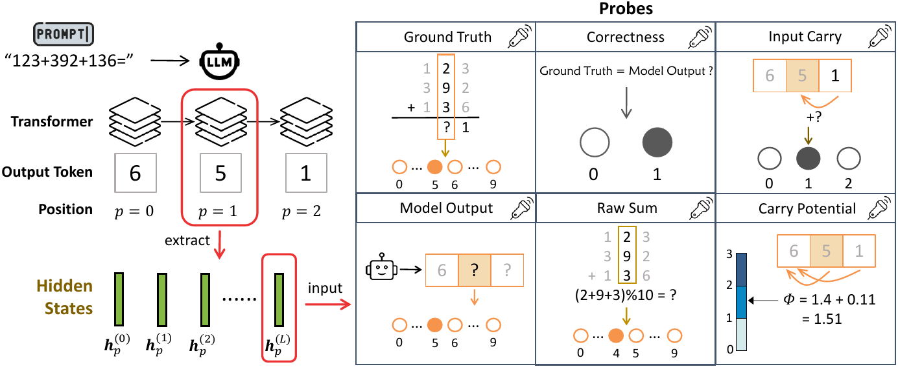

# The Shape of Addition: Geometric Structures of Arithmetic in Large Language Models

[ICML 2026] Official code of the paper "**The Shape of Addition: Geometric Structures of Arithmetic in Large Language Models**".

---

## 🎯 Abstract

  Large Language Models exhibit paradoxical fragility in fundamental arithmetic, implying a disconnect between internal computation and discrete output. By analyzing the residual stream geometry during multi-operand addition, we identify the Iso-Raw-Sum Trajectory (IRST), a geometric structure where representations are anchored by semantic digits and modulated by continuous carry fibers. We propose the Noisy Quantization Model to explain this geometry, framing arithmetic errors as Geometric Slippages caused by internal neural noise pushing a continuous, latent Carry Potential across quantization thresholds. This geometric framework further elucidates Probe Versatility, explaining how lightweight probes can disentangle coexisting latent signals (such as ground truth versus hallucination) from a single activation vector. Finally, we validate these insights through a geometric consistency check method that effectively detects and corrects these quantization failures during inference.




---

## Repository Layout

```text
Shape-of-Addition/
├── assets/                     
├── data/                       # Arithmetic datasets in pickle format
├── results/                    
├── src/                        
│   ├── generation.py           # Generate answers and save activation traces
│   ├── experiment.py           # Unified correction-method runner
│   ├── mlp_probe.py            
│   ├── linear_probe.py         
│   ├── dualstream.py           
│   ├── incarry_probe.py        
│   ├── error_decomposition.py  
│   ├── models.py               # Shared probe model definitions
│   ├── plotting/               # Figure and visualization implementations
│   └── utils/                  
├── requirements.txt
└── README.md
```

---

## Installation

```bash
pip install -r requirements.txt
cd Shape-of-Addition
```

---

## Datasets

The repository includes arithmetic datasets under `data/`. `num2len5-10000.pkl` denotes 2-number arithmetic, length 5, 10k samples.

---

## Quick Start

### Step 1 — Generate residual-stream activations

```bash
python src/generation.py \
  --model Qwen/Qwen3-4B \
  --dataset data/num3len10-100000.pkl \
  --sign plus \
  --max-samples 10000 \
  --output-h5 results/activations/plus_num3len10_Qwen3-4B/plus_num3len10_Qwen3-4B.h5
```

The output HDF5 file is the main input for probe, correction, decomposition, and plotting scripts.

### Step 2 — Train probes and run correction experiments

```bash
python src/experiment.py \
  --method all \
  --h5 results/activations/plus_num3len10_Qwen3-4B/plus_num3len10_Qwen3-4B.h5 \
  --dataset data/num3len10-10000.pkl \
  --model Qwen/Qwen3-4B \
  --layers -1 \
  --num-seeds 3 \
  --test-mode online \
  --out-dir results/logs/log_experiments/qwen3_4b
```

Supported methods:

| `--method` | Description |
|---|---|
| `replacement` | MLP-probe digit replacement correction |
| `steering` | Linear-probe steering correction |
| `dual-stream` | Dual-stream correction |
| `prompt` | Prompt-level correction baseline |
| `all` | Run all methods |

### Step 3 — Run error decomposition

```bash
python src/error_decomposition.py \
  --h5 results/activations/plus_num3len10_Qwen3-4B/plus_num3len10_Qwen3-4B.h5 \
  --dataset data/num3len10-10000.pkl \
  --pos 4 \
  --layer -1 \
  --out-dir results/logs/log_error_decomposition/qwen3_4b
```

### Step 4 — Generate figures

```bash
python src/plotting/umap_plots.py
python src/plotting/pca_plots.py
python src/plotting/error_decomposition_plots.py
python src/plotting/cluster_center_distance.py
```

---

## Key Arguments

| Argument | Description |
|---|---|
| `--dataset` | Pickle arithmetic dataset. Dataset names follow `num{terms}len{digits}-{samples}.pkl`. |
| `--h5` | Path to the HDF5 file produced by `src/generation.py`. 
| `--check-all-tokens` | Controls token-level evaluation during generation. `False` stops after the first incorrect token while preserving enough information for first-error analysis; `True` evaluates and stores all generated answer tokens. |
| `--test-mode` | Evaluation mode for correction scripts. `offline` evaluates corrections against saved HDF5 predictions without calling the language model; `online` calls the model for inference-time correction. |
| `--inertia-delta` | Tolerance window used by the dual-stream consistency check around the carry-potential quantization boundary. |
| `--first-error` | Keeps only samples where the selected position is the first erroneous position in the generated answer. |

---

## Outputs

By convention, generated artifacts are written under `results/`:

```text
results/
├── activations/          # HDF5 files from generation.py
├── checkpoints/          # Saved probe checkpoints
├── logs/                 # JSON logs and experiment summaries
├── plots/                # Figure outputs
└── tables/               
```


---


## 📝 Citation

If you find this work useful, please cite:

```bibtex
@inproceedings{
shapeofaddition,
title={The Shape of Addition: Geometric Structures of Arithmetic in Large Language Models},
author={Anonymous},
booktitle={Forty-third International Conference on Machine Learning},
year={2026}
}
```

---

## 📞 Contact
For questions or issues, please:

- Open an issue on GitHub
  
- Contact the authors at [lywen@smail.nju.edu.cn]
